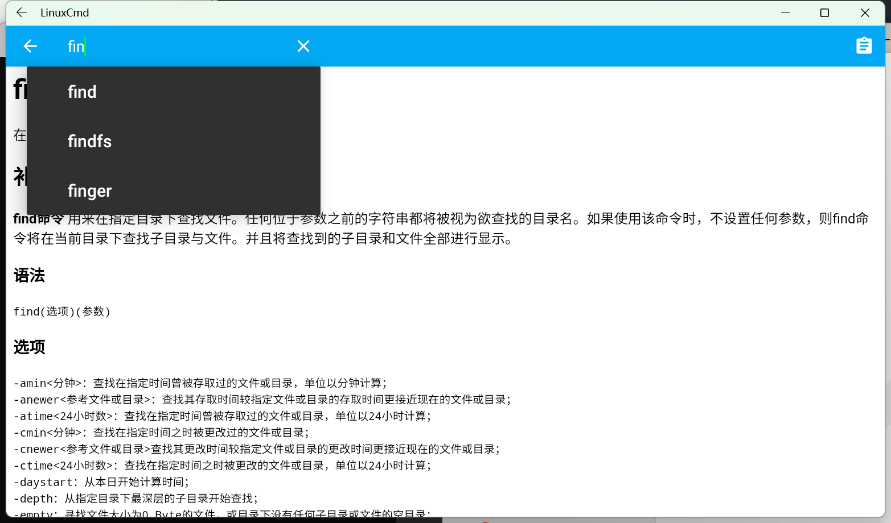
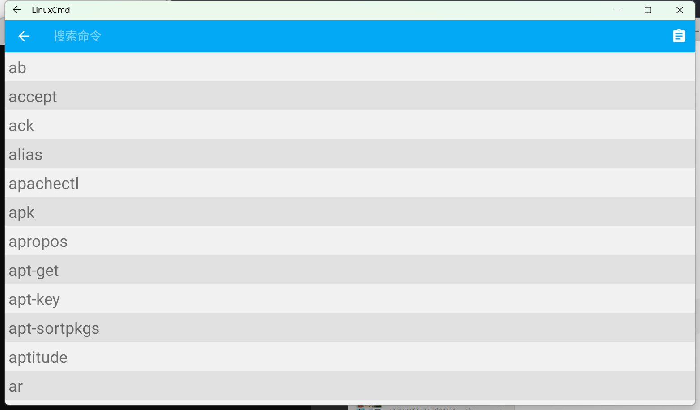

   

520多个 Linux 命令大全，内容包含 Linux 命令手册、详解、学习，值得收藏的 Linux 命令速查手册。内容来自网络和网友的补充，非常值得收藏的 Linux 命令速查手册。版权归属原作者，对任何法律问题及风险不承担任何责任

命令行文件来自 [jaywcjlove/linux-command](https://github.com/jaywcjlove/linux-command.git)   💗 感谢作者的辛勤付出。
欢迎PR.

## 界面截图

### 搜索命令及命令详情

### 命令列表

## Linux命令分类

*这里存放Linux 命令大全没有实时同步，请以实际内容为准。

### 文件传输

bye、ftp、ftpcount、ftpshut、ftpwho、ncftp、tftp、uucico、uucp、uupick、uuto、scp

### 备份压缩

ar、bunzip2、bzip2、bzip2recover、compress、cpio、dump、gunzip、gzexe、gzip、lha、restore、tar、unarj、unzip、zip、zipinfo

### 文件管理

diff、diffstat、file、find、git、gitview、ln、locate、lsattr、mattrib、mc、mcopy、mdel、mdir、mktemp、mmove、mread、mren、mshowfat、mtools、mtoolstest、mv、od、paste、patch、rcp、rhmask、rm、slocate、split、tee、tmpwatch、touch、umask、whereis、which、cat、chattr、chgrp、chmod、chown、cksum、cmp、cp、cut、indent

### 磁盘管理

cd、df、dirs、du、edquota、eject、lndir、ls、mcd、mdeltree、mdu、mkdir、mlabel、mmd、mmount、mrd、mzip、pwd、quota、quotacheck、quotaoff、quotaon、repquota、rmdir、rmt、stat、tree、umount

### 磁盘维护

badblocks、cfdisk、dd、e2fsck、ext2ed、fdisk、fsck.ext2、fsck、fsck.minix、fsconf、hdparm、losetup、mbadblocks、mformat、mkbootdisk、mkdosfs、mke2fs、mkfs.ext2、mkfs、mkfs.minix、mkfs.msdos、mkinitrd、mkisofs、mkswap、mpartition、sfdisk、swapoff、swapon、symlinks、sync

### 系统设置

alias、apmd、aumix、bind、chkconfig、chroot、clock、crontab、declare、depmod、dircolors、dmesg、enable、eval、export、fbset、grpconv、grpunconv、hwclock、insmod、kbdconfig、lilo、liloconfig、lsmod、minfo、mkkickstart、modinfo、modprobe、mouseconfig、ntsysv、passwd、pwconv、pwunconv、rdate、resize、rmmod、rpm、set、setconsole、setenv、setup、sndconfig、SVGAText Mode、timeconfig、ulimit、unalias、unset

### 系统管理

adduser、chfn、chsh、date、exit、finger、free、fwhois、gitps、groupdel、groupmod、halt、id、kill、last、lastb、login、logname、logout、logrotate、newgrp、nice、procinfo、ps、pstree、reboot、renice、rlogin、rsh、rwho、screen、shutdown、sliplogin、su、sudo、suspend、swatch、tload、top、uname、useradd、userconf、userdel、usermod、vlock、w、who、whoami、whois

### 文本处理

awk、col、colrm、comm、csplit、ed、egrep、ex、fgrep、fmt、fold、grep、ispell、jed、joe、join、look、mtype、pico、rgrep、sed、sort、spell、tr、uniq、vi、wc

### 网络通讯

dip、getty、mingetty、ppp-off、smbd(samba daemon)、telnet、uulog、uustat、uux、cu、dnsconf、efax、httpd、ip、ifconfig、mesg、minicom、nc、netconf、netconfig、netstat、ping、pppstats、samba、setserial、shapecfg(shaper configuration)、smbd(samba daemon)、statserial(status ofserial port)、talk、tcpdump、testparm(test parameter)、traceroute、tty(teletypewriter)、uuname、wall(write all)、write、ytalk、arpwatch、apachectl、smbclient(samba client)、pppsetup

### 设备管理

dumpkeys、loadkeys、MAKEDEV、rdev、setleds

### 电子邮件与新闻组

archive、ctlinnd、elm、getlist、inncheck、mail、mailconf、mailq、messages、metamail、mutt、nntpget、pine、slrn、X WINDOWS SYSTEM、reconfig、startx(start X Window)、Xconfigurator、XF86Setup、xlsatoms、xlsclients、xlsfonts

### 其他命令

yes
